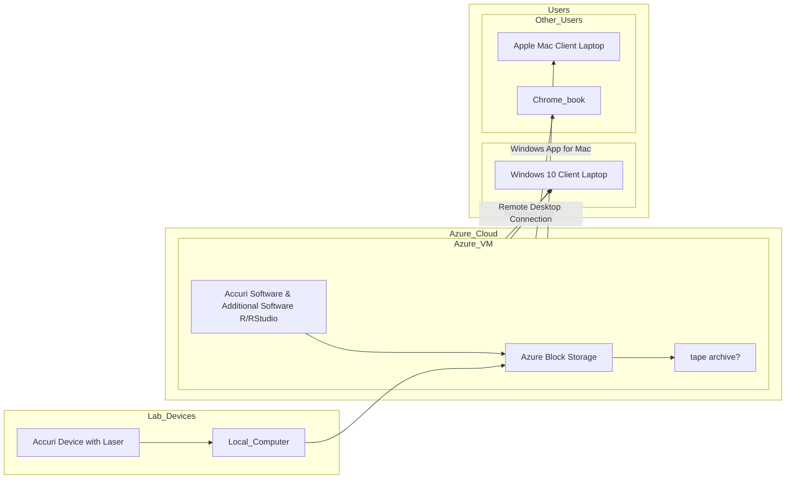

```mermaid


graph LR

subgraph Lab_Devices
    Accuri_Device[Accuri Device with Laser] --> Local_Computer
    
end

subgraph Azure_Cloud
  subgraph Azure_VM
    software[Accuri Software & Additional Software R/RStudio]
    Local_Computer --> block_storage[Azure Block Storage]
    block_storage[Azure Block Storage]
    archive[tape archive?]

    software --> block_storage[Azure Block Storage]
    block_storage[Azure Block Storage] --> archive
  end
end

  subgraph Users
    subgraph Windows_Users
      Azure_VM -->|Windows App| Windows_Client[Windows 11 Client Laptop]
      Azure_VM -->|Remote Desktop Connection| Windows_Client[Windows 10 Client Laptop]
    end
    subgraph Other_Users
    Azure_VM -->|Windows App for Mac| Mac_Client[Apple Mac Client Laptop]
    Azure_VM -->|Chrome Remote Desktop| Chrome_Book_Client[Chrome_book]
    end
  end


class Azure_VM vm
class block_storage storage
class Lab_Devices devices
class Windows_Client,Mac_Client client


```
